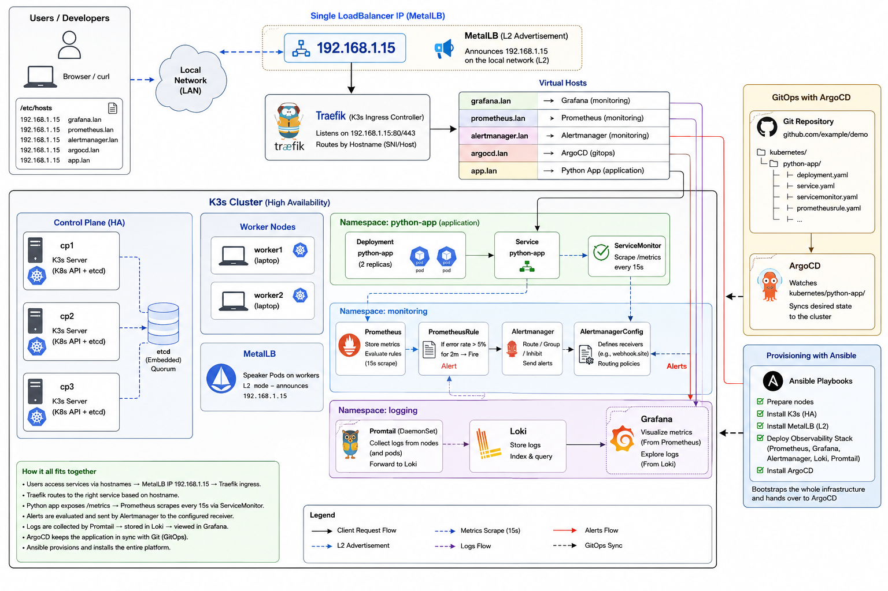

# observability-n-monitoring


A complete, GitOps‑driven **K3s cluster** with a full **observability stack** (Prometheus, Grafana, Loki, Alertmanager) and a sample Python application, all deployed and managed through **Ansible** and **ArgoCD**.

---
## Overview

This repository provides:

- Ansible playbooks to provision a high‑availability K3s cluster on bare‑metal/VM nodes (3 servers + 2 workers).
- MetalLB for LoadBalancer services in a home‑lab environment.
- kube‑prometheus‑stack (Prometheus, Grafana, Alertmanager) with pre‑loaded Grafana dashboards.
- Loki with Promtail for centralized logging.
- ArgoCD for GitOps continuous delivery, managing the sample Python application.
- The Python app exposes Prometheus metrics and demonstrates structured JSON logging.

---


---
## Architecture



---
- **3 K3s servers** form an HA control plane with embedded etcd.
- **2 K3s agents** (laptops) run workloads.
- **MetalLB** assigns LoadBalancer IPs from a local pool (`192.168.1.15–35`).
- **Traefik** (bundled with K3s) acts as ingress controller, routing traffic to:
  - `grafana.lan` → Grafana
  - `prometheus.lan` → Prometheus
  - `alertmanager.lan` → Alertmanager
  - `argocd.lan` → ArgoCD UI
  - `app.lan` → Python sample app
- All monitoring components run in the `monitoring` namespace, logs in `logging`, and ArgoCD in `argocd`.

---
## Prerequisites

- **Ansible** ≥ 2.15 on your control machine (with `kubernetes.core` and `community.general` collections).
- Python 3 and `pip` (for Python Kubernetes client if not already installed).
- `kubectl` (optional, for manual checks).
- **Nodes**: 5 machines (Debian/Ubuntu) reachable via SSH with `ken` user and the specified SSH key.
  - Hosts must be able to reach each other on the required ports.
  - Laptops require `gsettings` if you want to disable GNOME sleep (the playbook ignores errors otherwise).
- The `architecture-diagram.png` is not required for deployment.

---

## File Structure 

<!DOCTYPE html>
<html>
<body lang="en-US" link="#000080" vlink="#800000" dir="ltr"><pre class="western">

observability-n-monitoring/
|---ansible/
|   |---inventory/
|   |   |---production/
|   |       |---inventory.yaml
|   |       |---group_vars/
|   |           |---all.yaml
|   |           |---k3s_server.yaml
|   |           |---k3s_agent.yaml
|   |
|   |---playbooks/
|   |   |---site.yaml
|   |   |---00_ping_test.yaml
|   |   |---01_prepare_nodes.yaml
|   |   |---02_install_k3s_server.yaml
|   |   |---03_install_k3s_agent.yaml
|   |   |---04_install_metallb.yaml
|   |   |---05_deploy_observability.yaml
|   |   |---06_deploy_argocd_&amp;_configure_python_app_gitops.yaml
|   |
|   |---ansible.cfg
|
|---kubernetes/
|   |---argocd/
|   |   |---argocd-app.yaml
|   |
|   |---dashboards/
|   |   |---dashboard-configmap.yaml
|   |   |---dashboard-python-observability-app.json
|   |   |---alertmanager-overview.json
|   |   |---coreDNS.json
|   |   |---grafana-overview.json
|   |   |---kubernetes-api-server.json
|   |   |---kubernetes-compute-resources-cluster.json
|   |   |---kubernetes-compute-resources-multi-cluster.json
|   |   |---kubernetes-compute-resources-node-pods.json
|   |   |---kubernetes-kubelet.json
|   |   |---kubernetes-networking-cluster.json
|   |   |---kubernetes-networking-namespace-pods.json
|   |   |---kubernetes-networking-namespace-workload.json
|   |   |---kubernetes-networking-pod.json
|   |   |---kubernetes-networking-workload.json
|   |   |---kubernetes-persistent-volumes.json
|   |   |---node-exporter-AIX.json
|   |   |---node-exporter-nodes.json
|   |   |---node-exporter-use-method-cluster.json
|   |   |---node-exporter-use-method-node.json
|   |   |---prometheus-overview.json
|   |
|   |---metallb/
|   |   |---ipaddresspool.yaml
|   |   |---l2advertisement.yaml
|   |
|   |---observability/
|   |   |---monitoring-values.yaml
|   |   |---loki-values.yaml
|   |   |---loki-datasource.yaml
|   |
|   |---python-app/
|       |---deployment.yaml
|       |---service.yaml
|       |---servicemonitor.yaml
|       |---prometheusrule.yaml
|       |---alertmanagerconfig.yaml
|
|---app/
|   |---src/
|   |   |---main.py
|   |
|   |---Dockerfile
|   |---requirements.txt
|
|---docs/
|   |---architecture-diagram.png</pre>
</body>
</html>

---

## Quick Start

### 1. Clone the Repository

```bash
git clone https://github.com/kenkaserebe/observability-n-monitoring.git
cd observability-n-monitoring/ansible
```

### 2. Adjust Inventory

Edit ansible/inventory/production/inventory.yaml and the group_vars/ files to match your environment:
- Update ansible_host IPs and ansible_user.
- Set k3s_version and metallb_ip_pool as needed.
- Ensure the SSH key path is correct.

### 3. Install Ansible Requirements

```bash
pip install kubernetes
ansible-galaxy collection install kubernetes.core community.general
```

### 4. Run the Deployment

The master playbook deploys everything in order:

```bash
ansible-playbook playbooks/site.yaml --ask-become-pass
```

To run only specific parts, use tags:
```bash
# Only prepare nodes
ansible-playbook playbooks/site.yaml --tags prepare --ask-become-pass

# Only deploy the observability stack
ansible-playbook playbooks/site.yaml --tags observability

# Skip ArgoCD and app
ansible-playbook playbooks/site.yaml --skip-tags app
```

### 5. Access Services

After deployment, add the following entries to your local /etc/hosts (replace 192.168.1.15 with your Traefik LoadBalancer IP – typically the first MetalLB IP):

```text
192.168.1.15 grafana.lan prometheus.lan alertmanager.lan argocd.lan app.lan
```

- Grafana: http://grafana.lan (admin / prom-operator)
- Prometheus: http://prometheus.lan
- Alertmanager: http://alertmanager.lan
- ArgoCD: http://argocd.lan (user: admin, password: retrieved from secret - see deployment output or run command below)
```bash
kubectl -n argocd get secret argocd-initial-admin-secret -o jsonpath="{.data.password}" | base64 -d
```
- Sample App: http://app.lan (endpoints: /health, /hello?name=Ken, /metrics)

---
## Configuration & Customization

### Observability Stack

- Edit **kubernetes/observability/monitoring-values.yaml** to change Grafana admin password, retention, etc.
- Edit **kubernetes/observability/loki-values.yaml** to adjust Loki persistence size or storage class.
- Additional Grafana dashboards can be added by placing JSON files in **kubernetes/dashboards/** – they will be imported automatically on the next run of **06_deploy_observability.yaml**.

---
## Python Application

- The app is deployed via ArgoCD from the **kubernetes/python-app/** path.
- To use your own Docker image, update the **image:** field in **deployment.yaml** and push to your registry.
- Replace the webhook URL in **alertmanagerconfig.yaml** with a real endpoint (e.g., from [webhook.site](https://webhook.site/)).
- Metrics and alerting rules are defined in **servicemonitor.yaml** and **prometheusrule.yaml**.

---
## MetalLB IP Pool

Modify **metallb_ip_pool** in **group_vars/all.yaml** or directly edit the **ipaddresspool.yaml** file if you deploy manually.

---
## GitOps Workflow

Once the cluster is running, ArgoCD will automatically synchronise any changes pushed to the **kubernetes/python-app/** directory in the **main** branch. You can also manage the observability stack through ArgoCD by adding applications for the **kubernetes/observability/** path.

---
## Troubleshooting

- Playbook fails on **kubectl** commands: Ensure you have run **03_fetch_kubeconfig.yml** and that **~/.kube/config** is correctly set up.
- Loki pods stuck in **ContainerCreating**: Verify the **local-path** StorageClass is available (it is the default in K3s). Check disk space.
- ArgoCD UI not loading: Confirm the MetalLB IP is assigned to the Traefik service and that the **argocd.lan** host resolves. Also check that **server.insecure: "true"** is applied (the playbook handles this).
- No metrics for the Python app: Ensure the **ServiceMonitor** has label **release: monitoring** and that Prometheus is scraping the correct namespace (the **serviceMonitorNamespaceSelector: {}** allows any namespace).
- Webhook alerts not working: Replace the placeholder URL in **alertmanagerconfig.yaml** and re‑apply.